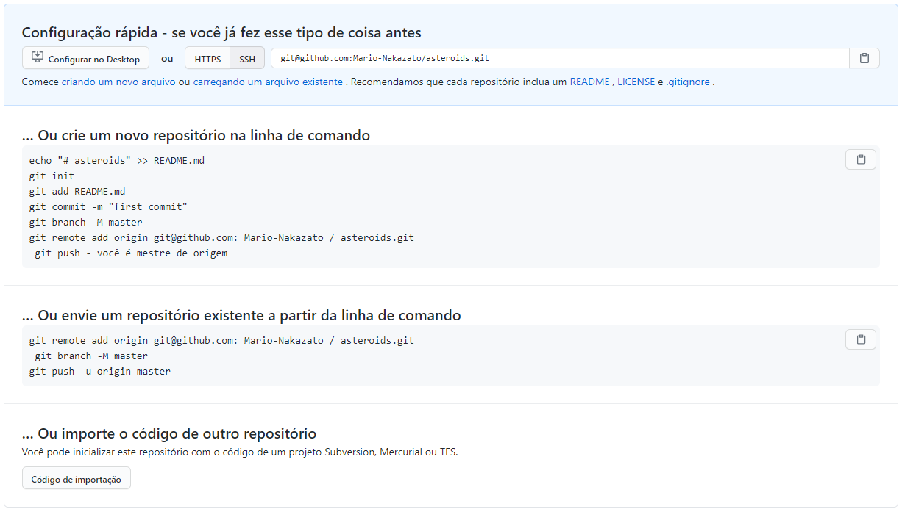

# **Git/Github - 20% -> 80%**

Sistema de controle de versão distribuido (Não centralizado)
---

- Terminal Bash padrão git branch padrão (master)

```
git 
```


### Comando

- Configurar usuario e email

```
git config --global user.name ""
git config --global user.email ""
```

- Configurar editor (vim, notepad, notepad++, vs code)

```
git config --global core.editor ""
```

- Criar novo repositorio para o projeto

```
git init
```

- Situação dos estados do repositorio

```
git status 
```

- Adicionar alterações realizadas, como quando cria novos arquivos ou pastas e quando elas são modificadas, adicionar ao commit arquivos novos ou modificados

```
git add ""
```

- Comprometer com as alterações -m comentario

```
git commit -m ""
```

- -a realiza o mesmo que **git add**

```
git commit -a -m ""
```

### Arquivo

- Arquivo de texto usado para ignorar arquivos do monitoramento

```
.gitignore
```
```
#comentario
arquivo.txt
pasta
caminho
```

- Mostra alterações realizadas em espera para serem **git add** para o proximo **git commit**

```
git diff
```

- Mostra alterações realizadas em espera para o proximo **git commit**

```
git diff --staged
```

- Mostra todos os commits realizados no repositorio

```
git log
```

- -p ordem cronologica mais o mesmo que **git diff** (Paginação)

```
git log -p
```

- -n numero de resultados n = numeros naturais

```
git log -p -4
```

- --pretty parametro para formatar os log para diferentes leituras
=oneline é a formato para a formatação

```
git log --pretty=oneline
```

### Informação dos commits

- Informação commit do **git log** temos a chave utilizada para referenciar a versão

```
commit <chave>
```

### Interface grafica

- Abrir interface grafica para visualização do repositorio

```
gitk
```

- Edita o ultimo commit realizado (absorve as alterações faltantes ou esquecidas) que deveriam estar no commit anterior realizado de forma prematura, tambem altera a chave do commit editado. Realizar alterações necessarias e executar o comando

```
git commit --amend -m ""
```

- Remover da staged o que o **git add** adicionou

```
git reset HEAD ""
```

- Reverter o estado atual do projeto para o commit anterior do repositorio

```
git checkout -- ""
```

- Remove alterações realizadas, como quando se excluir arquivos e pastas, adiciona ao commit os arquivos deletados

```
git rm ""
```

### Tags
##### Se realizar alteração o commit fica sem branch

- Listar as tags

```
git tag
```

- Cria tags o -a serve para criar uma tag anotada com as informações de quem a criou, tags simples pode ser criada para referencia sem o -a, tag é sempre criada 
no commit atual
```
git tag -a "" -m ""
```

- Cria tags para commit anteriores com o uso das chaves, visto em **git log --pretty=oneline**
```
git tag -a "" chave -m ""
```

- Detalhes de uma tag

```
git show ""
```

- Retornar para um commit utilizando as tags

```
git checkout ""
```

- Deletar uma tag

```
git tag -d ""
```
---
###### Compartilhar tags no git por padrão não envia as tags para servidor remotos, sendo necessario enviar explicitamente
- Enviar tags para servidores remotos

```
git push origin ""
```

### Branch

- Listar as branch

```
git branch
```

- Cria branch

```
git branch ""
```

- Transição uma seleção para outro branch com o estado atual

```
git checkout ""
```

- Cria a branch e seleciona

```
git checkout -b ""
```

- Deletar uma branch

```
git branch -d ""
```

### Merge

- Fundi as branch com as alterações, sempre estando com a branch destino selecionada com o **git checkout** e no comando a ira se juntar, merge automatico. Quando existe um conflito a merge automatico falha, e uma branch com as mistura é criada e assim devemos corrigir os conflitos e realizar um commit com as alterações corretas.

```
git merge ""
```

### Servidor

- Criar repositorio para servidor
```
git init --bare
```

- Clonar um repositorio
```
git clone ""
```

- Clonar um repositorio e nomear
```
git clone "" ""
```

- Nome do servidor por padrão origin
```
git remote
```

- Enviar as alterações commit para atualizar o servidor
```
git push origin master
```
```
git push servidor branch
```

- Receber as alterações commit atualizadas no servidor
```
git pull origin master
```

```
git pull servidor branch
```

- Receber as alterações commit atualizadas no servidor, mas em uma branch criada, para o git não realizar o merge com o master local onde ainda esta sendo realiado tarefas
```
git fetch origin branch
```

### Github

- Criar par de chaves ssh \r\r\r adicione na configuração do github e crie um repositorio e copie o link ssh do repositoiro
```
ssh-keygen
```

### Fork

- Criar um fork (Clone) de um repositorio que deseja colaborar para a sua conta github

### Pull Request

- Enviar um pull request do github editar a branch com os commit para o repositorio colaborado original

### Merge Pull Request

- Aceitar as alterações do repositorio enviado pelo colaborador

### Usei para parar de verificar alteração no arquivo .env

- Para de verificar alteração - git update-index --assume-unchanged .env
- Votla a verificar alteração - git update-index --no-assume-unchanged .env

### Ajuda Github



# Atualizações

- git switch -c <new-branch-name\> ?
